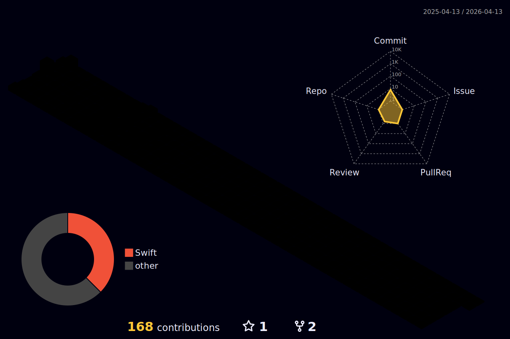

# My GitHub Stats

---

---

## 🐍 Contributions

<picture>
  <source media="(prefers-color-scheme: dark)" srcset="https://github.com/aadi-aarrllo/aadi-aarrllo/blob/output/github-contribution-grid-snake-dark.svg" />
  <source media="(prefers-color-scheme: light)" srcset="https://github.com/aadi-aarrllo/aadi-aarrllo/blob/output/github-contribution-grid-snake.svg" />
  
</picture>

---

